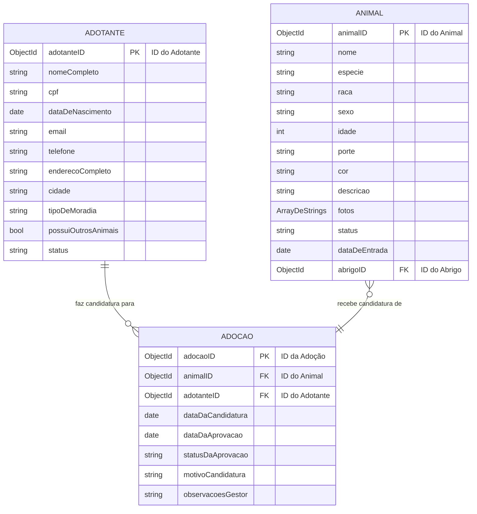

# Modelo de Dados – EncontreUmAmigo

Este documento descreve o modelo de dados conceitual e lógico para o projeto "EncontreUmAmigo", apresentando as principais entidades do sistema e seus relacionamentos, incluindo um Diagrama de Entidade e Relacionamento (ERD).

## 1. Entidades do Modelo de Dados

As entidades abaixo representam as principais estruturas de dados que serão armazenadas e gerenciadas no banco de dados.

### **1.1. Entidade: `Animal`**

Representa um animal resgatado e disponível para adoção.

* `animalID`: (Tipo: `ObjectId` ou `UUID`) Identificador único do animal (Chave Primária).
* `nome`: (Tipo: `String`) Nome pelo qual o animal é conhecido.
* `especie`: (Tipo: `String`) Espécie do animal (ex: "Cão", "Gato", "Outros").
* `raca`: (Tipo: `String`) Raça do animal (ex: "Vira-lata", "Labrador").
* `sexo`: (Tipo: `String`) Sexo do animal (ex: "Macho", "Fêmea").
* `idade`: (Tipo: `Number`) Idade aproximada do animal em anos.
* `porte`: (Tipo: `String`) Porte do animal (ex: "Pequeno", "Médio", "Grande").
* `cor`: (Tipo: `String`) Cor predominante do animal.
* `descricao`: (Tipo: `String`) Texto longo descrevendo o temperamento, histórico de saúde e particularidades.
* `fotos`: (Tipo: `Array de Strings/URLs`) Lista de URLs ou caminhos para as imagens do animal.
* `status`: (Tipo: `String`) Status atual do animal (ex: "Disponível", "Em Processo de Adoção", "Adotado").
* `dataDeEntrada`: (Tipo: `Date`) Data em que o animal foi acolhido pelo abrigo.
* `abrigoID`: (Tipo: `ObjectId` ou `UUID`) Chave Estrangeira para o abrigo onde o animal está (assumindo que existirá uma entidade 'Abrigo' no futuro).

### **1.2. Entidade: `Adotante`**

Representa uma pessoa interessada em adotar um animal e que preencheu o formulário de candidatura.

* `adotanteID`: (Tipo: `ObjectId` ou `UUID`) Identificador único do adotante (Chave Primária).
* `nomeCompleto`: (Tipo: `String`) Nome completo do adotante.
* `cpf`: (Tipo: `String`) Número do CPF do adotante.
* `dataDeNascimento`: (Tipo: `Date`) Data de nascimento do adotante.
* `email`: (Tipo: `String`) Endereço de e-mail para contato.
* `telefone`: (Tipo: `String`) Número de telefone para contato.
* `enderecoCompleto`: (Tipo: `String`) Endereço residencial completo.
* `cidade`: (Tipo: `String`) Cidade de residência.
* `tipoDeMoradia`: (Tipo: `String`) Tipo de moradia (ex: "Casa com Quintal", "Apartamento").
* `possuiOutrosAnimais`: (Tipo: `Boolean`) Indica se o adotante já possui outros animais.
* `status`: (Tipo: `String`) Status do cadastro do adotante (ex: "Ativo", "Inativo").

### **1.3. Entidade: `Adocao`**

Representa o registro de uma candidatura ou processo de adoção, ligando um animal a um adotante.

* `adocaoID`: (Tipo: `ObjectId` ou `UUID`) Identificador único do registro de adoção (Chave Primária).
* `animalID`: (Tipo: `ObjectId` ou `UUID`) Chave Estrangeira referenciando o `animalID` da entidade `Animal`.
* `adotanteID`: (Tipo: `ObjectId` ou `UUID`) Chave Estrangeira referenciando o `adotanteID` da entidade `Adotante`.
* `dataDaCandidatura`: (Tipo: `Date`) Data em que a candidatura foi submetida.
* `dataDaAprovacao`: (Tipo: `Date`) Data em que a adoção foi aprovada (nulo se ainda não aprovado).
* `statusDaAprovacao`: (Tipo: `String`) Status da candidatura (ex: "Em Análise", "Aprovada", "Recusada", "Cancelada").
* `motivoCandidatura`: (Tipo: `String`) Texto explicando o motivo pelo qual o adotante deseja adotar.
* `observacoesGestor`: (Tipo: `String`) Notas e observações do gestor sobre o processo.

## 2. Diagrama de Entidade e Relacionamento (ERD)

O diagrama abaixo ilustra as entidades definidas acima e os relacionamentos entre elas, fornecendo uma visão clara da estrutura do banco de dados.



---
```

-----

**Observações Importantes:**

  * **Tipos de Dados:** Adaptei os tipos de dados para serem mais genéricos (`ObjectId` ou `UUID` para IDs, `String`, `Number`, `Date`, `Boolean`, `Array de Strings`) já que você está usando MongoDB, que é flexível. Se fosse SQL (PostgreSQL, MySQL), usaríamos `INT`, `VARCHAR`, `DATE`, `BOOLEAN`, etc.
  * **Relacionamentos no ERD:** Ajustei a notação Mermaid para indicar as chaves estrangeiras (`FK`) e os relacionamentos entre as entidades.
  * **`abrigoID` em `ANIMAL`:** Incluí um `abrigoID` na entidade `Animal` como uma Chave Estrangeira. Isso implica que, em um sistema real, você teria uma entidade `Abrigo` (com informações como nome, endereço do abrigo, etc.), mas para este nível de detalhe, podemos apenas indicar a conexão.

Com este arquivo, a parte do banco de dados está super documentada e pronta para o seu repositório\!

Falta agora apenas um arquivo para completar a estrutura principal do `docs/`: o **`api_specification.md`**. Queremos seguir para ele?
